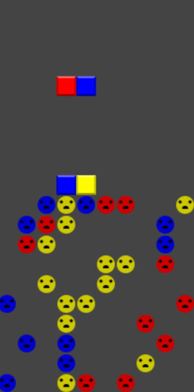

# Dr. Mario

[Dr. Mario live][mario]

[mario]: https://cjudge1337.github.io/Javascript-Dr-Mario/

Dr. Mario is a recreation of the Nintendo puzzle game written over 2 days. The objective is to clear the board of all the viruses using the colored pills.
Matching 4 or more in a row of the same color clears the row.



The game was built using vanilla Javascript and HTML5 Canvas. A two-dimensional array is used to store the game's state. Each frame, the grid is redrawn based on the colors and properties stored in a Block object assigned to each space of the array.

## Technical Implementations

This was my first time using the HTML canvas tag, and it was challenging initially to draw what I needed. The basic squares of the pills looked bad, so I used the hsl property to give some depth to them. I also made "pixelX" and "pixelY" variables to match up the pixel values necessary for canvas with the 10x20 two-dimensional array that stored the game data.

```javascript
drawBlock(xPos, yPos, hue, virus = false) {
  let pixelX = xPos * 20;
  let pixelY = (19 - yPos) * 20;
  if (hue !== -1) {
    if (virus === false) {
      this.ctx.fillStyle = `hsl(${hue}, 100%, 50%)`;
      this.ctx.fillRect(pixelX + 2, pixelY + 2, 16, 16);

      this.ctx.fillStyle = `hsl(${hue}, 100%, 70%)`;
      this.ctx.beginPath();
      this.ctx.moveTo(pixelX, pixelY);
      this.ctx.lineTo(pixelX + 20, pixelY);
      this.ctx.lineTo(pixelX + 18, pixelY + 2);
      this.ctx.lineTo(pixelX + 2, pixelY + 2);
      this.ctx.fill();

      this.ctx.fillStyle = `hsl(${hue}, 100%, 40%)`;
      this.ctx.beginPath();
      this.ctx.moveTo(pixelX, pixelY);
      this.ctx.lineTo(pixelX, pixelY + 20);
      this.ctx.lineTo(pixelX + 2, pixelY + 18);
      this.ctx.lineTo(pixelX + 2, pixelY + 2);
      this.ctx.fill();

      this.ctx.beginPath();
      this.ctx.moveTo(pixelX + 20, pixelY);
      this.ctx.lineTo(pixelX + 20, pixelY + 20);
      this.ctx.lineTo(pixelX + 18, pixelY + 18);
      this.ctx.lineTo(pixelX + 18, pixelY + 2);
      this.ctx.fill();

      this.ctx.fillStyle = `hsl(${hue}, 100%, 30%)`;

      this.ctx.beginPath();
      this.ctx.moveTo(pixelX, pixelY + 20);
      this.ctx.lineTo(pixelX + 20, pixelY + 20);
      this.ctx.lineTo(pixelX + 18, pixelY + 18);
      this.ctx.lineTo(pixelX + 2, pixelY + 18);
      this.ctx.fill();

    } else if (virus === true) {
      this.ctx.fillStyle = `hsl(${hue}, 100%, 40%)`;
      this.ctx.beginPath();
      this.ctx.arc(pixelX + 10, pixelY + 10, 9, 0, 2*Math.PI);
      this.ctx.fill();

      this.ctx.fillStyle = 'black';
      this.ctx.beginPath();
      this.ctx.arc(pixelX + 5, pixelY + 7, 1.5, 0, 2*Math.PI);
      this.ctx.closePath();
      this.ctx.fill();

      this.ctx.beginPath();
      this.ctx.arc(pixelX + 15, pixelY + 7, 1.5, 0, 2*Math.PI);
      this.ctx.closePath();
      this.ctx.fill();

      this.ctx.beginPath();
      this.ctx.arc(pixelX + 10, pixelY + 14, 3, 0, Math.PI, true);
      this.ctx.closePath();
      this.ctx.fill();
    }
  }
}
```

In order to redraw pills each frame, the #drawPill() function can both check the squares that are input into it to make sure they are valid, and actually draw the pill. This will work only if both squares will keep the "valid" variable true. The checking and modification of the grid's array values happens in #serGrid(). When #setGrid() is given "test" as a string it will return a boolean instead of setting the grid's color.

```javascript
drawPill(xPos, yPos, orientation, color1 = randomColor(), color2 = randomColor()) {
  let valid = true;

  if (orientation === 'horizontal1') {
    valid = valid && this.setGrid(xPos, yPos, color1);
    valid = valid && this.setGrid(xPos - 1, yPos, color2);
  } else if (orientation === 'vertical1') {
    valid = valid && this.setGrid(xPos, yPos, color1);
    valid = valid && this.setGrid(xPos, yPos + 1, color2);
  } else if (orientation === 'horizontal2') {
    valid = valid && this.setGrid(xPos, yPos, color2);
    valid = valid && this.setGrid(xPos - 1, yPos, color1);
  } else if (orientation === 'vertical2') {
    valid = valid && this.setGrid(xPos, yPos, color2);
    valid = valid && this.setGrid(xPos, yPos + 1, color1);
  }

  return valid;
}
```
```javascript
setGrid(x, y, color) {
  if (x >= 0 && x < 10 && y >= 0 && y < 20) {
    if(color === "test") return this.grid[y][x].color === -1;

    this.grid[y][x].color = color;
    return true;
  }
  return false;
}
```

## Future Additions
- Sound
- Multiple levels
- Retro graphics
